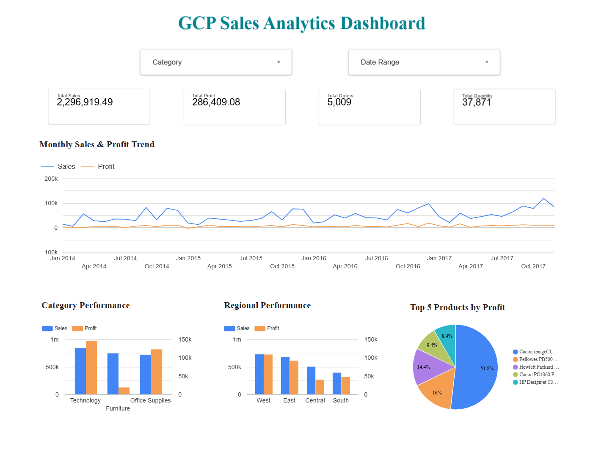

# 🚀 GCP Sales Analytics Pipeline

<p align="center">
  <strong>An End-to-End Cloud Data Engineering & Analytics Pipeline</strong><br>
  Python · Pandas · SQL · Google BigQuery · Looker Studio
</p>

<p align="center">
  
  
  
  
  
</p>

<p align="center">
  <a href="https://datastudio.google.com/reporting/9d39935f-bfc1-4080-a934-7f7d720dbeb5/page/aOo7F">
    <strong>📊 View Interactive Dashboard</strong>
  </a>
</p>

---

## 📌 Overview

**GCP Sales Analytics Pipeline** is an end-to-end data engineering project that transforms raw retail transaction data into a clean, validated, analytics-ready dataset and loads it into **Google BigQuery** for analytical processing.

The project demonstrates a practical workflow:

> **Ingestion → Exploration → Cleaning → Validation → BigQuery → SQL Analytics → Interactive BI Dashboard**

The pipeline is modular and orchestrated through a single Python entry point, making the workflow reproducible and easy to extend.

---

## 🎯 Project Highlights

- 🐍 Python/Pandas ETL pipeline
- 🧹 Data cleaning and standardization
- 🛡️ Automated data-quality validation
- ☁️ Google BigQuery data warehouse
- 🗃️ Explicit BigQuery schema
- 📊 SQL analytical views and KPI queries
- 📈 Interactive Looker Studio dashboard
- 🎛️ Category and date-range filtering
- 🔐 Environment-based configuration and credential safety
- 🧩 Modular project structure
- 📝 Git/GitHub version control

---

## ⚡ At a Glance

| Metric | Result |
|---|---:|
| Records before cleaning | 9,994 |
| Records after cleaning | **9,993** |
| Columns | **9** |
| Final missing values | **0** |
| Final duplicate records | **0** |
| Total Sales | **2,296,919.49** |
| Total Profit | **286,409.08** |
| Total Orders | **5,009** |
| Total Quantity | **37,871** |
| Average Discount | **≈ 15.62%** |
| BigQuery Dataset | `sales_dataset` |
| BigQuery Table | `sales_table` |

> One duplicate record was removed during the cleaning stage. The final validated dataset contains 9,993 records with zero remaining duplicates.

---

# 🏗️ Architecture

```text
                    ┌──────────────────────┐
                    │      RAW CSV DATA    │
                    │    sales_data.csv    │
                    └──────────┬───────────┘
                               │
                               ▼
                    ┌──────────────────────┐
                    │  DATA EXPLORATION    │
                    │    Python / Pandas   │
                    └──────────┬───────────┘
                               │
                               ▼
                    ┌──────────────────────┐
                    │    DATA CLEANING     │
                    │    Python / Pandas   │
                    └──────────┬───────────┘
                               │
                               ▼
                    ┌──────────────────────┐
                    │   DATA VALIDATION    │
                    │ Schema & Quality     │
                    │       Checks         │
                    └──────────┬───────────┘
                               │
                         PASS / FAIL
                               │
                         ┌─────┴─────┐
                         │           │
                       FAIL         PASS
                         │           │
                       STOP          ▼
                           ┌──────────────────────┐
                           │  CLEANED DATASET     │
                           │ cleaned_sales_data   │
                           │       .csv            │
                           └──────────┬───────────┘
                                      │
                                      ▼
                           ┌──────────────────────┐
                           │     GOOGLE CLOUD     │
                           │       BigQuery       │
                           └──────────┬───────────┘
                                      │
                         ┌────────────┴────────────┐
                         │                         │
                         ▼                         ▼
                  ┌──────────────┐        ┌──────────────────┐
                  │ sales_table  │        │ Analytical Views │
                  └──────┬───────┘        └────────┬─────────┘
                         │                           │
                         └────────────┬──────────────┘
                                      ▼
                           ┌──────────────────────┐
                           │   LOOKER STUDIO      │
                           │ Interactive Dashboard│
                           └──────────────────────┘
```

---

# 🔄 Pipeline Flow

```text
01  Extract
      ↓
02  Explore
      ↓
03  Transform
      ↓
04  Validate
      ↓
05  Load → BigQuery
      ↓
06  Analyze → SQL
      ↓
07  Visualize → Looker Studio
      ↓
08  Business Insights
```

| Stage | Purpose | Technology |
|---|---|---|
| Extract | Read raw retail data | CSV |
| Explore | Understand structure and quality | Python + Pandas |
| Transform | Clean and standardize records | Python + Pandas |
| Validate | Verify data quality and business rules | Python |
| Load | Store analytics-ready data | BigQuery |
| Analyze | Generate KPIs and analytical datasets | SQL |
| Visualize | Build interactive analytics | Looker Studio |
| Insight | Interpret business performance | SQL + BI |

---

# 📊 Dashboard

The final dashboard provides:

- **Total Sales**
- **Total Profit**
- **Total Orders**
- **Total Quantity**
- **Monthly Sales & Profit Trend**
- **Category Performance**
- **Regional Performance**
- **Top 5 Products by Profit**
- **Category filter**
- **Date-range filter**

### Dashboard Preview



### 🔗 Live Interactive Dashboard

**[Open GCP Sales Analytics Dashboard](https://datastudio.google.com/reporting/9d39935f-bfc1-4080-a934-7f7d720dbeb5/page/aOo7F)**

> The dashboard uses the granular `sales_table` as the interactive source so category and date controls can filter the KPIs and visualizations consistently.

---

# 📁 Dataset

The pipeline processes transactional retail sales data.

### Dataset dimensions

```text
Records before cleaning : 9,994
Records after cleaning  : 9,993
Columns                 : 9
```

### Schema

| Column | Type | Description |
|---|---|---|
| `order_id` | STRING | Order identifier |
| `date` | DATE | Transaction date |
| `region` | STRING | Sales region |
| `category` | STRING | Product category |
| `product` | STRING | Product name |
| `sales` | FLOAT | Sales amount |
| `quantity` | INTEGER | Quantity sold |
| `discount` | FLOAT | Discount applied |
| `profit` | FLOAT | Profit generated |

---

# 🧹 Data Engineering Workflow

## 1. Data Exploration

**`scripts/data_exploration.py`**

Examines:

- Dataset shape
- Column names
- Data types
- Numerical statistics
- Unique values
- Category distribution
- Regional distribution
- Potential quality issues

---

## 2. Data Cleaning

**`scripts/data_cleaning.py`**

The cleaning stage:

```text
Raw CSV
   │
   ├── Standardize column names
   ├── Handle missing values
   ├── Remove duplicate records
   ├── Convert data types
   ├── Standardize dates
   └── Save cleaned dataset
```

### Input

```text
data/sales_data.csv
```

### Output

```text
data/cleaned_sales_data.csv
```

---

## 3. Data Validation

**`scripts/data_validation.py`**

Automated quality checks include:

```text
✓ Schema validation
✓ Missing-value detection
✓ Duplicate detection
✓ Quantity validation
✓ Sales validation
✓ Discount validation
```

### Final validation result

```text
Total records:        9993
Total columns:        9
Total missing:        0
Total duplicates:     0
Invalid quantities:   0
Invalid sales:        0
Invalid discounts:    0
```

If validation fails, the pipeline stops before the BigQuery load.

---

# ☁️ Google BigQuery

BigQuery acts as the analytical cloud data warehouse.

```text
Google Cloud Project
        │
        ▼
     BigQuery
        │
        ▼
 sales_dataset
        │
        ▼
  sales_table
```

### BigQuery table

```text
Dataset : sales_dataset
Table   : sales_table
Rows    : 9,993
Columns : 9
```

An explicit schema is used during the load process rather than relying entirely on automatic schema detection.

---

# 🗃️ SQL Analytics Layer

The SQL layer contains reusable analytical views and business queries.

### Analytical views

```text
sql/views/
├── category_performance.sql
├── monthly_sales.sql
├── product_performance.sql
├── regional_performance.sql
├── sales_summary.sql
└── top_products.sql
```

### Core analysis

```text
Overall KPIs
Regional Performance
Category Performance
Monthly Sales & Profit
Product Profitability
Discount vs Profitability
Top Products
```

---

# 📈 Business Insights

### 🥇 Regional Performance

**West** is the highest-sales region in the analyzed dataset.

### 🏷️ Category Performance

**Technology** leads the categories in both total sales and total profit.

### 💸 Discount vs Profitability

Higher discount ranges show substantially weaker profitability in this dataset, with some high-discount ranges producing negative total profit.

> **High revenue does not necessarily mean high profitability.**

### 📅 Monthly Trends

Monthly aggregation allows the business to compare sales and profit across time and identify stronger and weaker periods.

---

# 🧪 Data Quality

| Check | Result |
|---|---:|
| Records | **9,993** |
| Columns | **9** |
| Missing Values | **0** |
| Duplicate Records | **0** |
| Invalid Quantities | **0** |
| Invalid Sales | **0** |
| Invalid Discounts | **0** |

```text
Raw Data
   │
   ▼
Cleaning
   │
   ▼
Validation
   │
   ├── ❌ FAIL → Stop Pipeline
   │
   └── ✅ PASS
          │
          ▼
       BigQuery
```

---

# 📁 Project Structure

```text
gcp-data-engineering-pipeline/
│
├── data/
│   ├── sales_data.csv
│   └── cleaned_sales_data.csv
│
├── scripts/
│   ├── data_exploration.py
│   ├── data_cleaning.py
│   ├── data_validation.py
│   └── load_to_bigquery.py
│
├── sql/
│   ├── views/
│   │   ├── category_performance.sql
│   │   ├── monthly_sales.sql
│   │   ├── product_performance.sql
│   │   ├── regional_performance.sql
│   │   ├── sales_summary.sql
│   │   └── top_products.sql
│   │
│   └── analysis_queries.sql
│
├── docs/
│   └── images/
│       └── dashboard.png
│
├── run_pipeline.py
├── requirements.txt
├── .gitignore
└── README.md
```

---

# ⚙️ Pipeline Orchestration

**`run_pipeline.py`** is the single entry point.

Run:

```bash
python run_pipeline.py
```

Execution flow:

```text
run_pipeline.py
      │
      ├── Data Cleaning
      │
      ├── Data Validation
      │
      ├── BigQuery Load
      │
      └── Analytical View Deployment
```

A failed validation or pipeline stage prevents the workflow from continuing.

---

# 🛠️ Technology Stack

### Programming

- Python
- SQL

### Python

- Pandas
- Google Cloud BigQuery Client

### Google Cloud

- Google Cloud Platform
- Google BigQuery
- Google Cloud CLI

### Analytics

- Looker Studio
- Analytical SQL
- KPI reporting
- Business intelligence

### Data Engineering

- ETL
- Data cleaning
- Data transformation
- Data validation
- Data quality
- Schema management
- Cloud data warehousing
- SQL analytics
- Pipeline orchestration

### Development

- Visual Studio Code
- Git
- GitHub
- Google Cloud Console

---

# 🚀 Getting Started

## Prerequisites

Install:

```text
Python 3.x
Git
Google Cloud CLI
Google Cloud account
```

## 1. Clone the repository

```bash
git clone https://github.com/rajaadit11/gcp-data-engineering-pipeline.git
cd gcp-data-engineering-pipeline
```

## 2. Create a virtual environment

### Windows PowerShell

```powershell
python -m venv .venv
.venv\Scripts\Activate.ps1
```

### Windows CMD

```cmd
python -m venv .venv
.venv\Scripts\activate
```

## 3. Install dependencies

```bash
pip install -r requirements.txt
```

---

# 🔐 Google Cloud Authentication

Authenticate with Google Cloud:

```bash
gcloud auth login
```

Set the active project:

```bash
gcloud config set project YOUR_PROJECT_ID
```

Configure Application Default Credentials:

```bash
gcloud auth application-default login
```

Verify:

```bash
gcloud config get-value project
```

> Do not commit credential files or secrets to GitHub.

---

# ▶️ Run the Pipeline

```bash
python run_pipeline.py
```

Expected high-level flow:

```text
============================================================
        GCP DATA ENGINEERING PIPELINE
============================================================

[1] DATA CLEANING
        ↓
[2] DATA VALIDATION
        ↓
[3] BIGQUERY LOAD
        ↓
[4] ANALYTICAL VIEW DEPLOYMENT
        ↓
[✓] PIPELINE COMPLETED SUCCESSFULLY
```

---

# 🔎 Run SQL Analysis

After the pipeline completes:

1. Open Google Cloud Console.
2. Navigate to BigQuery.
3. Open `sales_dataset`.
4. Open the SQL workspace.
5. Use `sql/analysis_queries.sql`.
6. Replace `YOUR_PROJECT_ID` with your actual project ID if required.

Example:

```sql
SELECT
    DATE_TRUNC(date, MONTH) AS month,
    SUM(sales) AS total_sales,
    SUM(profit) AS total_profit
FROM `YOUR_PROJECT_ID.sales_dataset.sales_table`
GROUP BY month
ORDER BY month;
```

---

# 🔒 Security

**Never commit credentials to GitHub.**

Do not commit:

```text
❌ Service-account private keys
❌ application_default_credentials.json
❌ API keys
❌ Passwords
❌ Authentication tokens
❌ .env secrets
❌ Cloud credentials
```

Recommended ignored files/directories:

```text
.venv/
.env
*.json
__pycache__/
```

Always verify:

```bash
git status
```

before pushing.

---

# 🧠 Engineering Concepts Demonstrated

```text
                    DATA ENGINEERING
                           │
          ┌────────────────┼────────────────┐
          ▼                ▼                ▼
         ETL          DATA QUALITY     DATA WAREHOUSE
          │                │                │
          ▼                ▼                ▼
   Python/Pandas       Validation       BigQuery
          │                │                │
          └────────────────┼────────────────┘
                           ▼
                     SQL ANALYTICS
                           │
                           ▼
                    LOOKER STUDIO
                           │
                           ▼
                  BUSINESS INSIGHTS
```

### Core concepts

- ETL architecture
- Data ingestion
- Data transformation
- Data cleaning
- Data-quality validation
- Schema management
- Cloud data warehousing
- Analytical SQL
- Aggregations
- Date-based analysis
- Pipeline orchestration
- Cloud authentication
- Reproducibility
- Version control

---

# 🏭 Future Production Evolution

The current implementation is a **local-to-cloud batch pipeline**. A production-scale version could evolve toward:

```text
Data Sources
     │
     ▼
Cloud Storage / Landing Zone
     │
     ▼
Managed Processing
     │
     ▼
Data Quality + Monitoring
     │
     ▼
BigQuery Data Warehouse
     │
     ▼
SQL / BI Analytics
     │
     ▼
Dashboards & Business Users
```

Potential future enhancements:

- Google Cloud Storage ingestion
- Scheduled pipeline execution
- Managed workflow orchestration
- Automated testing
- Centralized logging
- Monitoring and alerting
- Data-quality alerts
- CI/CD
- Incremental loading
- Partitioned and clustered BigQuery tables

These are **future enhancements**, not claims about the current implementation.

---

# 📚 Learning Outcomes

### Python

```text
Pandas
File Handling
Functions
Modules
Exception Handling
Pipeline Orchestration
```

### SQL

```text
SELECT
WHERE
GROUP BY
ORDER BY
Aggregations
Date Functions
Business Analytics
```

### Data Engineering

```text
ETL
Data Cleaning
Data Validation
Schema Design
Data Warehouse
Data Quality
Pipeline Design
```

### Cloud

```text
Google Cloud
BigQuery
Cloud Authentication
Cloud Data Warehousing
```

### Software Engineering

```text
Modular Architecture
Version Control
Project Structure
Documentation
Reproducibility
Error Handling
```

---

# 📌 Project Status

<p align="center">

### 🟢 Completed — End-to-End Batch Analytics Pipeline

</p>

```text
████████████████████████████████████████  Data Ingestion
████████████████████████████████████████  Data Cleaning
████████████████████████████████████████  Data Validation
████████████████████████████████████████  BigQuery
████████████████████████████████████████  SQL Analytics
████████████████████████████████████████  Looker Studio
████████████████████████████████████████  Interactive Filters
████████████████████████████████████████  Documentation

░░░░░░░░░░░░░░░░░░░░░░░░░░░░░░░░░░░░░░  Cloud Storage Ingestion
░░░░░░░░░░░░░░░░░░░░░░░░░░░░░░░░░░░░░░  Scheduled Orchestration
░░░░░░░░░░░░░░░░░░░░░░░░░░░░░░░░░░░░░░  Monitoring / Alerting
░░░░░░░░░░░░░░░░░░░░░░░░░░░░░░░░░░░░░░  CI/CD
```

---

# 👨‍💻 Author

## Aditya Raj

**Software Engineering · Data Engineering · AI/ML**

B.Tech — Electronics & Communication Engineering

### Interests

```text
Software Engineering
Data Engineering
AI / ML
Data Science
Cloud Platforms
System Design
```

---

# ⭐ Why This Project?

This project goes beyond simply uploading a CSV file to BigQuery.

It demonstrates an engineering workflow from raw data to business-facing analytics:

```text
RAW DATA
   │
   ▼
UNDERSTAND DATA
   │
   ▼
CLEAN DATA
   │
   ▼
VALIDATE DATA
   │
   ▼
LOAD TO CLOUD
   │
   ▼
ANALYZE WITH SQL
   │
   ▼
BUILD BI DASHBOARD
   │
   ▼
GENERATE INSIGHTS
```

The main emphasis is on:

> **Data reliability · Modularity · Reproducibility · Cloud integration · Analytics**

---

# 📄 License

This project is created for **educational, learning, and portfolio purposes**.

---

<p align="center">
  ⭐ If you found this project useful, consider giving it a star!
  <br><br>
  <strong>Built with Python 🐍 · SQL 🗄️ · BigQuery ☁️ · Looker Studio 📊 · Curiosity 🚀</strong>
</p>
